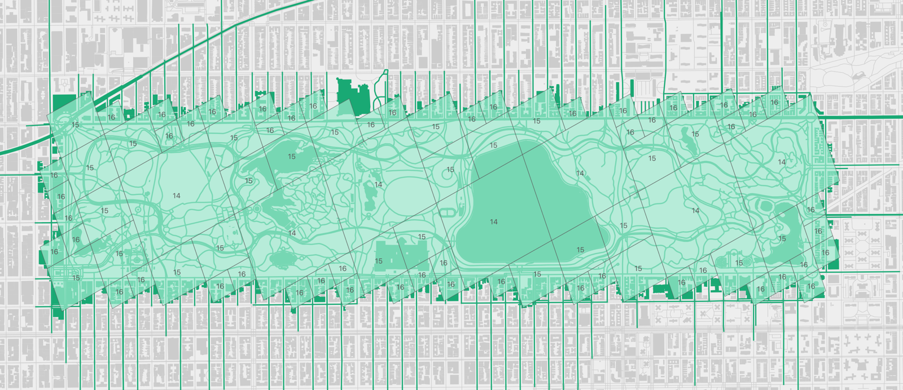

# OSM Express



[Manual](https://protomaps.com/docs/osmexpress/), [Programming Guide](https://protomaps.com/docs/osmexpress/programming-guide/)

OSM Express is a fast storage format for OpenStreetMap that powers [Protomaps](https://protomaps.com) tools.

* **Random access:** Look up nodes, ways and relations by ID; fetch member nodes to construct geometries.
* **Spatial indexing:** Nodes are bucketed into [S2 Geometry](http://s2geometry.io) cells. Access a region by providing a cell covering; works for nonrectanglar regions.
* **Scalable:** OSM Express works the same way for OSM data of any size, from a small city to the entire planet. The entire planet can be worked with efficiently on typical hardware such as a laptop computer.
* **In-place updates:** Included are scripts to download minutely changesets from [planet.openstreetmap.org](https://planet.openstreetmap.org) and apply them to an .osmx database.
* **Concurrent access:** Multiple processes can open the database file for reading simultaneously. No running server process is required. Writing minutely updates doesn't block reader access. Reads and writes are transactional. 

## Details

OSM Express is a compact 1,500 LOC, and really a cobbling together of a few low-level libraries:

* [Libosmium](https://osmcode.org/libosmium/index.html) for the reading and writing of OSM data.
* [LMDB](https://symas.com/lmdb) for a `mmap`-based ACID key-value store with fast cursor-based iteration.
* [Cap'n Proto](https://capnproto.org) for in-memory and on-disk storage of OSM elements.
* [CRoaring](https://roaringbitmap.org) for in-memory storage of ID sets as compressed bitmaps.
* [S2 Geometry](http://s2geometry.io) for indexing of geographic coordinates.

## Usage

OSM Express is being used in production, but should still be considered experimental with an unstable API. The simplest way to use it is via the `osmx` command line program. It can also be embedded into a C++ project by including headers.

### Command line

```bash
osmx expand planet.osm.pbf planet.osmx # converts a pbf or xml to osmx. Takes 5-10 hours for the planet, resulting in a ~600GB file.
osmx extract planet.osmx extract.osm.pbf --bbox 40.7411\,-73.9937\,40.7486\,-73.9821 # extract a new pbf for the given bounding box.
osmx update planet.osmx 3648548.osc 3648548 2019-08-29T17:50:02Z --commit # applies an OsmChange diff.
osmx stat planet.osmx # Print statistics, seqnum and timestamp.
osmx query planet.osmx way 34633854 # look up an element by ID.
```

Detailed command line usage can be found in the [Manual](https://protomaps.com/docs/osmexpress).

### Headers

The C++ API is currently very rough with minimal abstraction. [examples/print_wkt.cpp](examples/print_wkt.cpp) is a short, commented C++ program that uses the headers to read a way from a .osmx file and outputs its [Well-Known Text](https://en.wikipedia.org/wiki/Well-known_text_representation_of_geometry) LineString geometry.

```bash
./print_wkt ../ny.osmx 34633854
Empire State Building	LINESTRING (-73.9864855 40.7484833,-73.9851554 40.7479226,-73.9848259 40.7483735,-73.9861526 40.7489422,-73.9863111 40.7487242,-73.9863282 40.7487007,-73.9864684 40.7485078,-73.9864855 40.7484833)
```

[examples/bbox_wkt.cpp](examples/bbox_wkt.cpp) is a more complex example that takes a bounding box as input, and returns WKT LineStrings for ways that overlap the bbox. This overlap is an approximation based on cells and may include ways outside the bounding box.

Detailed C++ usage can be found in the [Programming Guide](https://protomaps.com/docs/osmexpress/programming-guide).

### Other languages

TBD

## License and Development

2-Clause BSD, see [LICENSE.md](LICENSE.md). Bug reports, pull requests welcome! For support, new features, and integration, contact [hi@protomaps.com](mailto:hi@protomaps.com).

